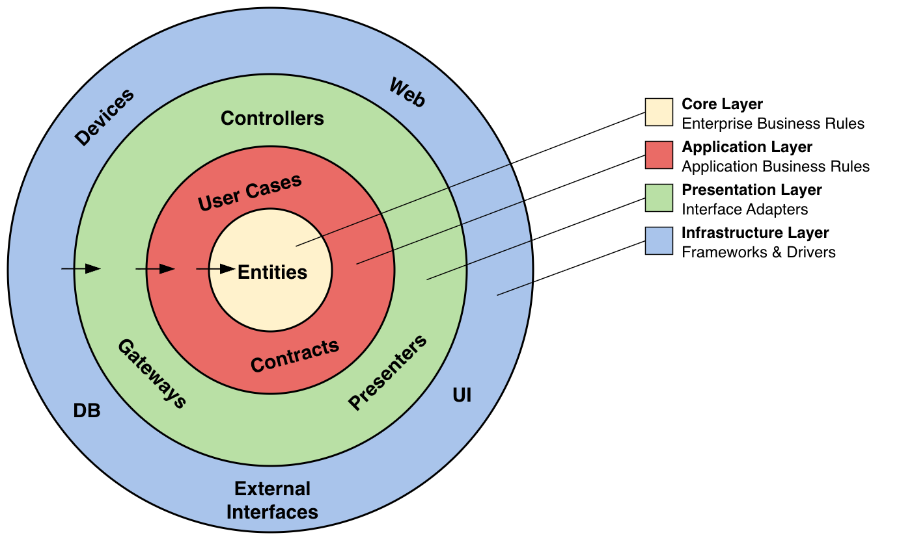
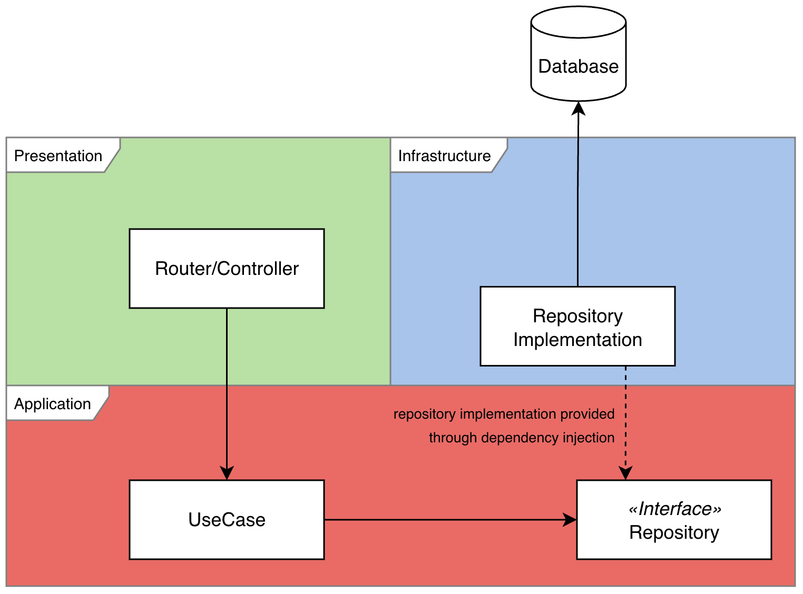

# health-check-api

The api can be spin up with a test db using the provided [docker-compose.yaml](./docker-compose.yaml) file.

- Further instructions are provided in [project-setup.md](./project-setup.md).

To use the image, refer to [.env.example](./.env.example) for the required environment variables.

## Workflow
Using Github Actions the project automatically builds an image when changes to code are pushed to the main branch. The image can be pulled from `ghcr.io/mattisjensen/health-check-api:latest`

On Pull Requests
- tests are run to ensure code quality and functionality before allowing a merge to main.
- the image is built to ensure that the code builds correctly, but not pushed to the registry.

## Architecture

The project follows principles of [Clean Architecture](https://blog.cleancoder.com/uncle-bob/2012/08/13/the-clean-architecture.html) leveraging maintainability by having clear dependency flow and decoupling components for high cohesion and low coupling. 

In combination with dependency injection, this allows for flexible swapping of implementations and easier testing.

As can be seen on the following diagram, Clean Architecture is separating the project into layers with clear responsibilities and dependency rules.

For instance, the router, which handles incoming requests, depends on the use case layer to execute business logic. The use case layer interacts with the repository interface to fetch data, without knowing the implementation details of how the data is fetched.

Compared to a traditional three-tier layered architecture, Clean Architecture enforces that dependencies only point inwards towards the core business rules. This prevents unwanted coupling between outer layers, for example the database and the core, enhancing maintainability and testability.

